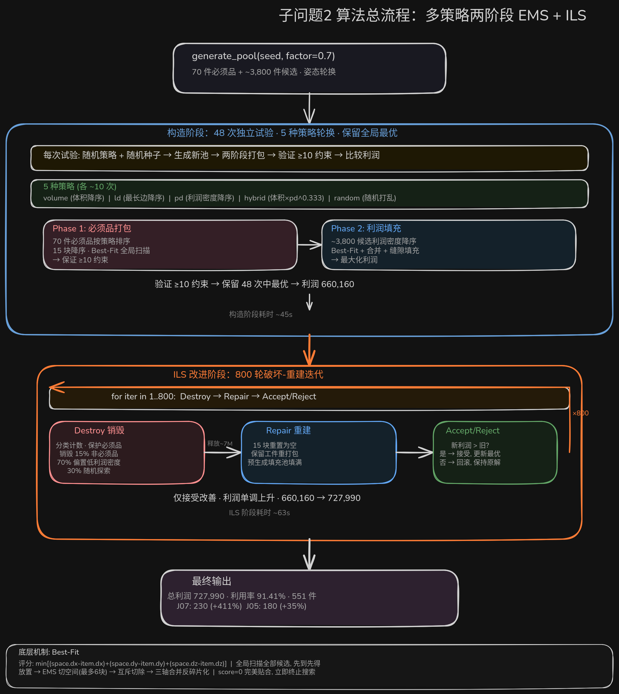

# 子问题 2 算法详解：从零到最优解

> 求解器：`ems_solver_optimal.py` | 算法：多策略两阶段 EMS 贪心 + 破坏-重建迭代局部搜索
>
> 本文档是面向初学者的逐步教学材料，零基础可读。

---

## 一、输入数据

### 1.1 原材料（15 块）

| 类型 | 尺寸 (mm) | 单块体积 | 数量 | 总体积 |
|------|-----------|---------|------|--------|
| L01 | 300 × 200 × 150 | 9,000,000 | 5 | 45,000,000 |
| L02 | 250 × 150 × 100 | 3,750,000 | 5 | 18,750,000 |
| L03 | 200 × 150 × 80 | 2,400,000 | 5 | 12,000,000 |
| **合计** | | | **15** | **75,750,000** |

### 1.2 工件（7 种，每种 ≥ 10 件）

| 工件 | 尺寸 (mm) | 体积 | 利润 | 利润密度 |
|------|-----------|------|------|----------|
| J01 | 40 × 40 × 40 | 64,000 | 620 | 0.00969 |
| J02 | 50 × 40 × 40 | 80,000 | 780 | 0.00975 |
| J03 | 60 × 50 × 30 | 90,000 | 880 | 0.00978 |
| J04 | 75 × 60 × 40 | 180,000 | 1,850 | 0.01028 |
| J05 | 80 × 60 × 50 | 240,000 | 2,520 | 0.01050 |
| J06 | 100 × 50 × 20 | 100,000 | 1,000 | 0.01000 |
| J07 | 120 × 20 × 20 | 48,000 | 540 | **0.01125** |

> **关键洞察**：J07 利润密度最高（0.01125），但形状是细长条（长宽比 6:1），需要至少 120mm 的连续空间维度才能放入。J05 利润密度第二（0.01050），且体积最大（240,000），是「大块 + 高利润」的主力。

### 1.3 姿态（6 种摆放方式）

长方体有 6 种不同的摆放方向（长宽高的排列）。例如 J07（120, 20, 20）的 6 种姿态中有 3 种本质不同：

```
(120, 20, 20)  (20, 120, 20)  (20, 20, 120)
```

（另外 3 种因为有两个 20 相等而产生重复，实际可用 3 种）

---

## 二、EMS（Empty Maximal Spaces）—— 空间管理

EMS 是整算法的基础数据结构。核心思想：**用一个列表维护所有互不重叠的空闲空间**。

### 2.1 数据结构

```python
@dataclass
class Space:
    x: int; y: int; z: int    # 空间原点坐标
    dx: int; dy: int; dz: int  # 空间三轴尺寸
```

一个 Space 代表原材料内部的一个长方体空闲区域。初始状态整个块就是一个 Space：

```
Space(x=0, y=0, z=0, dx=300, dy=200, dz=150)  # L01
```

### 2.2 切空间（split）

在空间中放一个工件后，工件体积必须从空间中切除。工件放在空间的原点角落 `(x, y, z)` 处，切除后最多生成 **6 个子空间**：

```
         ┌──────────────────────┐
         │      上方 (z+)        │  ← 工件上表面到空间顶面
         ├──────┬───────────────┤
         │      │               │
         │ 前方 │   工件占位     │ 后方 (x-)
         │ (y+) │   (已切除)    │
         │      │               │
         ├──────┴───────────────┤
         │      下方 (z-)        │  ← 空间底面到工件下表面
         └──────────────────────┘
         左方(x-)           右方(x+)
```

代码实现（`split_space`）：

```python
def split_space(sp, rx, ry, rz, rdx, rdy, rdz):
    res = []
    # 6个方向, 每个方向如果有剩余空间就生成一个新Space
    if rz - sp.z > 0:              # 下方
        res.append(Space(sp.x, sp.y, sp.z, sp.dx, sp.dy, rz-sp.z))
    if sp.z+sp.dz-rz-rdz > 0:      # 上方
        res.append(Space(sp.x, sp.y, rz+rdz, sp.dx, sp.dy, sp.z+sp.dz-rz-rdz))
    if ry - sp.y > 0:              # 前方
        res.append(Space(sp.x, sp.y, rz, sp.dx, ry-sp.y, rdz))
    if sp.y+sp.dy-ry-rdy > 0:      # 后方
        res.append(Space(sp.x, ry+rdy, rz, sp.dx, sp.y+sp.dy-ry-rdy, rdz))
    if rx - sp.x > 0:              # 左方
        res.append(Space(sp.x, ry, rz, rx-sp.x, rdy, rdz))
    if sp.x+sp.dx-rx-rdx > 0:      # 右方
        res.append(Space(rx+rdx, ry, rz, sp.x+sp.dx-rx-rdx, rdy, rdz))
    return res
```

**具体例子**：L03（200×150×80）原点放 J01（40×40×40）

```
原材料: 200×150×80
工件:   40×40×40 放在 (0,0,0)

切除后生成 3 个子空间:
  空间1 (右方): 原点(40, 0, 0)   尺寸(160, 150,  80)  体积=1,920,000
  空间2 (前方): 原点( 0,40, 0)   尺寸( 40, 110,  80)  体积=  352,000
  空间3 (上方): 原点( 0, 0,40)   尺寸( 40,  40,  40)  体积=   64,000

验证: 64,000 + 1,920,000 + 352,000 + 64,000 = 2,400,000 = 200×150×80 ✓
```

### 2.3 相交切除

新工件放入后，不仅要从所在空间切除，还要检查它是否「刺穿」了**其他**空闲空间。如果有相交，则从那个空间中也切除相交部分。

```
get_intersection(sp, item_x, item_y, item_z, item_dx, item_dy, item_dz)
→ 返回相交区域, 或 None
```

相交区域用 `split_space` 从该空间中切除，保持所有空间互不重叠。

### 2.4 合并空间（merge）—— 反碎片化

切空间会让空间越来越碎。两个相邻空间如果满足三条件之一即可合并：

- **x 方向合并**：y、dy、z、dz 相同，且 A.x+A.dx == B.x（A 在 B 左边贴面）
- **y 方向合并**：x、dx、z、dz 相同，且 A.y+A.dy == B.y（A 在 B 前面贴面）
- **z 方向合并**：x、dx、y、dy 相同，且 A.z+A.dz == B.z（A 在 B 下面贴面）

合并是**迭代进行**的——合并产生的大空间可能和另一个空间合并，循环直到没有更多合并可能。

```
合并前:
  Space A: (0, 0, 0, 100, 50, 80)  体积=400,000
  Space B: (0,50, 0, 100, 30, 80)  体积=240,000
  → x相同, dx相同, z相同, dz相同, A.y+A.dy=B.y ✓ 可以合并!

合并后:
  Space C: (0, 0, 0, 100, 80, 80)  体积=640,000

不合并 → 两个空间独立, 都放不下 60mm 深的工件
合并后 → 一个 80mm 深的空间, 可以放入
```

### 2.5 放置全流程（try_place）

```python
def try_place(name, dx, dy, dz):
    # 1. 在所有空间中找最紧贴的
    fitting = [(i, s) for i,s in enumerate(spaces) if s.can_fit(dx,dy,dz)]
    best_space = min(fitting, key=lambda x: 
        (x[1].dx-dx)+(x[1].dy-dy)+(x[1].dz-dz))
    
    # 2. 在原点的角落放置
    px, py, pz = best_space.x, best_space.y, best_space.z
    
    # 3. 切除已放置空间
    spaces.pop(best_idx)
    new_spaces = split_space(best_space, px, py, pz, dx, dy, dz)
    
    # 4. 检查所有其他空间是否与新工件相交
    for s in spaces:
        inter = get_intersection(s, px, py, pz, dx, dy, dz)
        if inter: new_spaces.extend(split_space(s, *inter))
        else: cleaned.append(s)
    
    spaces = cleaned + new_spaces
    
    # 5. 定期合并（空间数 > 150 时触发）
    if len(spaces) > 150:
        spaces = merge_spaces(spaces)
```

---

## 三、Best-Fit —— 选择下一步放哪个工件

这是决定「在当前位置，下一步放哪个工件最合适」的贪心策略。

### 3.1 评分函数

```
贴合度 = (space.dx - item.dx) + (space.dy - item.dy) + (space.dz - item.dz)
```

三个维度方向上的间隙之和。值越小 → 工件越紧贴空间边界 → 废料越少。**score = 0 表示完美贴合**。

### 3.2 选择过程（find_best_to_place）

```python
def find_best_to_place(candidates):
    best_score = ∞
    for item in candidates:
        for space in spaces:
            if space.can_fit(item):
                gap = (space.dx-item.dx)+(space.dy-item.dy)+(space.dz-item.dz)
                # 记录该工件的最佳适配
        if item.best_gap < best_score:
            # 该工件是所有候选中贴合最紧密的
            best_score = item.best_gap
            best_item = item
        if best_score == 0: break  # 完美贴合, 立即终止
    return best_item
```

**关键特性**：

- **全局扫描**：不采样，而是每个候选工件都在所有空间中找最佳适配。这保证了不会漏掉完美的匹配
- **大件偏好**：大工件在空旷空间中的间隙绝对值往往更小 → Best-Fit 天然偏向大件。这是需要在算法设计层面解决的问题，而非 Best-Fit 本身的缺陷

### 3.3 具体例子

L01 大空间 `(300×200×150)` 中有两个候选：

```
J05 (80×60×50):
  放入空间 (300×200×150), 间隙 = (300-80)+(200-60)+(150-50) = 220+140+100 = 460
  → 间隙较大因为单空间太大

J07 (120×20×20):
  放入空间 (300×200×150), 间隙 = (300-120)+(200-20)+(150-20) = 180+180+130 = 490
  → 间隙更大

结果: J05 胜出 (460 < 490)，尽管 J07 利润密度更高
```

这解释了**为什么不能把大小件混在一起**：Best-Fit 天然偏爱能「填满」空间的大件。

---

## 四、两阶段策略 —— 保证可行性 + 追求利润

### 4.1 为什么必须是两阶段

如果所有工件（必须品 + 候选）混在一个池子里排序打包，会发生：

```
单阶段灾难:
  J07(利润密度最高) 排最前 → 在大块上放入一些
  J05(利润密度第二) 排队 → Best-Fit 偏好大件，J05抢在更多J07之前
  J04, J06 陆续放入
  ...
  J01, J02(利润密度最低) 排队时 → 大块空间已碎片化，小块不够大
  → J01/J02 可能只放入了 2-3 件 → 约束违反!

即使 J01/J02 侥幸放了 10 件，放的过程也很低效
因为它们在堆里优先级太低，总是最后才被考虑
```

**两阶段方案**：Phase 1 独立处理 70 件必须品，Phase 2 处理全部候选。

```
Phase 1 (70 件必须品) → 保证 ≥10 约束永不被违反
Phase 2 (~3,700 件候选) → 尽情追求利润，无需担心约束
```

### 4.2 什么是「策略」

**策略只影响一件事：Phase 1 中 70 件必须品的排列顺序。**

70 件必须品 = 7 种工件 × 10 件。Phase 1 要把这 70 件全部放进 15 块料里，但先放谁后放谁，5 种策略各有不同意见。

Phase 2 不受策略影响——永远是利润密度降序，最大化利润。

### 4.3 五种策略详解

#### (1) `two_phase_volume` — 体积优先

```
排序依据: 工件单件体积, 从大到小
排列顺序: J05(240,000) → J04(180,000) → J06(100,000) → J03(90,000)
          → J02(80,000) → J01(64,000) → J07(48,000)
```

大块头先占位，小不点最后塞缝。这是最直觉的做法——先摆大家具，再塞小物件。与原版算法一致。

**问题**：J07 体积最小（48,000），排在最后。轮到它时 Phase 1 已接近完成，75%+ 的空间碎片化，120mm 连续空间稀缺 → J07 只能填进少数缝隙。

#### (2) `two_phase_ld` — 最长边优先

```
排序依据: 工件单件的最长边, 从大到小
排列顺序: J07(120mm) → J06(100mm) → J05(80mm) → J04(75mm)
          → J03(60mm) → J02(50mm) → J01(40mm)
```

**这是 J07 从 45 涨到 230 的关键策略。**

J07 虽然体积小，但最长边 120mm 是 7 种工件中最大的。排在最前意味着 Phase 1 初期 15 块料基本是空的：

```
L01(300×200×150): x 方向可并排 2 个 J07, y 方向可叠 10 个, z 方向可堆 7 个
                  → 单块理论上放 2×10×7 = 140 个
L02(250×150×100): 单块可放 2×7×5 = 70 个
L03(200×150×80):  单块可放 1×7×4 = 28 个
```

在空间还高度规整时，J07 的 120mm 长边轻松找到位置。Phase 1 结束后，大量 J07 已经稳妥放好，Phase 2 还能再补一批。

#### (3) `two_phase_pd` — 利润密度优先

```
排序依据: 工件利润密度, 从大到小
排列顺序: J07(0.01125) → J05(0.01050) → J04(0.01028)
          → J06(0.01000) → J03(0.00978) → J02(0.00975) → J01(0.00969)
```

能赚钱的先放。高利润密度工件在空间规整时占据有利位置。不过 Phase 2 同样按利润密度排序，所以这个策略的边际收益不如 ld 明显。

#### (4) `two_phase_hybrid` — 混合

```
排序依据: 体积 × 利润密度^0.333, 从大到小
排列顺序: J05 → J04 → J06 → J03 → J02 → J01 → J07
```

用利润密度^0.333 对体积做加权修正。利润密度的指数 0.333（开立方）意味着体积起主导作用，利润密度起微调作用。结果 J05 仍然排第一，J07 体积太小加权后仍排最后。本质更接近 volume 策略。

#### (5) `two_phase_random` — 随机

```
排序依据: random.random(), 每次不同
排列顺序: 完全随机打乱
```

纯碰运气。可能在某次运气好时发现其他策略找不到的排列。提供最大搜索多样性。

### 4.4 为什么需要 5 种策略

单策略的问题是**每种策略发现的解结构不同**：

| 策略 | Phase1 结束时的空间特点 | Phase2 填充效果 |
|------|------------------------|----------------|
| volume | 大块已被 J05/J04 占满，碎片多 | J07 难找 120mm 空间，产量低 |
| ld | J07 大量已放入，规整空间仍较多 | J05 仍有空间，J07 继续高产出 |
| pd | 高利润件已占好位 | 中等利润件补充 |
| hybrid | 类似 volume | 类似 volume |

不同策略发现的解结构差异大，多策略保证至少有一个方向找到好解。实际运行中 `ld` 策略在第一次试验就拿到构造最优 660,160。

### 4.5 48 次构造试验

每次试验做的事完全一样，变的只有两样：**策略 + 随机种子**。

```
试验 1: 策略 ld,     种子 380  → pool → Phase1+2 → 利润 660,160 ★
试验 2: 策略 volume,  种子 447  → pool → Phase1+2 → 利润 615,430
试验 3: 策略 hybrid,  种子 514  → pool → Phase1+2 → 利润 642,890
试验 4: 策略 random,  种子 581  → pool → Phase1+2 → 利润 598,210
...
试验 48: 策略 pd,     种子 3529 → pool → Phase1+2 → 利润 653,780
```

5 种策略各分配约 10 次（48 ÷ 5 ≈ 9.6），打乱顺序避免连续的相同策略。48 次结束后，取利润最高的那次（660,160）进入 ILS。

**为什么需要 48 次**：贪心算法对排列顺序和随机因素敏感。同样的 ld 策略，不同种子生成不同姿态的候选（J07 横放 vs 竖放），Best-Fit 选出来的结果也不同。单次可能倒霉（random 策略这次 J07 刚好排最后），48 次保证至少有一次比较走运。

### 4.6 候选池生成

```
剩余体积 = 75,750,000 - 8,020,000 (70件必须品) = 67,730,000

每种工件的候选数 = max(60, int(67,730,000 / 单件体积 × 0.7))

J07: max(60, int(67,730,000/48,000 × 0.7)) ≈ max(60, 988) = 988
J05: max(60, int(67,730,000/240,000 × 0.7)) ≈ max(60, 197) = 197
...
总计约 3,800 件候选
```

候选品的姿态用轮换（遍历 6 种排列），保证每种姿态都有机会。因子 0.7 是经验参数——太小则候选不足 Best-Fit 没得选，太大则扫描变慢。

### 4.7 Phase 2：利润填充

Phase 1 结束后，剩余约 89.4% 的体积。Phase 2 将候选池中的约 3,800 件工件**统一按利润密度降序**排列：

```
J07(0.01125) × 988 → J05(0.01050) × 197 → J04(0.01028) × 263
→ J06(0.01000) × 474 → J03(0.00978) × 526 → J02(0.00975) × 592
→ J01(0.00969) × 740
```

按此顺序用 Best-Fit 依次往 15 块料的剩余空间中填充。最终约 481 件被成功放入，其余候选作废。

**为什么是利润密度降序？**

Best-Fit 是「先到先得」——排前面的工件优先从最规整的空间中挑位置。利润密度高的工件排在前面，可以先挑。反过来如果 J01（利润密度最低）排前面，J01 先去占了最好的位置，等 J07 来时只能塞碎片空间——但 J07 是 120mm 长条，碎片空间容不下。所以利润密度降序的本质是：**让单位体积最赚钱的工件优先挑选空间，确保它们不受低利润工件的排挤。**

然后做**缝隙填充**：
1. 按废料体积降序处理各块
2. 优先用小尺寸工件（最短边 ≤ 30mm，如 J07 的 20mm 边）填充碎片空间
3. 再尝试所有剩余工件
4. 合并空间后重试

---

## 五、ILS 破坏-重建 —— 从 660,160 爬升到 727,990

ILS（Iterated Local Search，迭代局部搜索）的核心逻辑：

```
给定当前最优解（551 件，利润 660,160）

每轮迭代做四件事:
  1. 分类 — 每种工件保留 10 件必须品，超出的标记为「可销毁」
  2. 销毁 — 从可销毁工件中拆掉 15%，优先拆利润密度低的
  3. 重建 — 保留的工件全部清空重新打包 + 用新工件填满空位
  4. 判断 — 新利润 > 旧利润？接受 : 回滚

重复 800 轮，利润单调上升。
```

关键设计是**销毁的偏置**：J01(利润密度 0.00969) 被拆的概率远高于 J07(0.01125)。销毁 10 个 J04 释放 1,800,000 体积，腾出来的空间塞 37 个 J07，一进一出利润净增约 1,500。

贪心构造解中工件一旦放入就永不移动，ILS 打破这个限制——故意拆掉差的选择，让好的选择有机会进来。

### 5.1 第一步：分类

从当前最优解提取所有已放置的 551 件工件，按类型统计。每类前 10 件标记为「必须品」——永不销毁，保证 ≥10 约束在 ILS 全程不被打破。超出 10 件的部分标记为「可销毁」：

```
工件  总数  必须品（前10件）  可销毁
J01    11       10               1
J02    15       10               5
J03    24       10              14
J04    23       10              13
J05   180       10             170
J06    68       10              58
J07   230       10             220
合计  551       70             481
```

必须品 70 件永不销毁，可销毁工件共 481 件。从中挑出 15%（约 72 件）拆掉。

### 5.2 第二步：销毁

481 件可销毁工件中挑 72 件拆掉。两种策略随机切换：

**70% 概率：偏置低利润密度**

```
把 481 件可销毁工件按利润密度排序：
  J07(0.01125) × 220 → J05(0.01050) × 170 → J04(0.01028) × 13
  → J06(0.01000) × 58 → J03(0.00978) × 14 → J02(0.00975) × 5
  → J01(0.00969) × 1

用加权随机选择：排名越靠后，被销毁概率越高
权重 = 1 / (排名 + 1)

结果：J01 被拆概率 >> J05 >> J07（几乎不会被拆）
```

**30% 概率：完全随机**

不区别利润密度，等概率拆掉任何可销毁工件。纯粹碰运气，保持探索性——也许拆掉几个 J07 反而能发现更好的布局。

销毁 72 件约释放 7,000,000 mm³ 体积。

### 5.3 第三步：重建

销毁 72 件后，保留的 479 件全部清空。15 块料重置为空，从头打包：

```
清空 15 块 → 重置为空
保留工件 479 件利润密度降序 → Best-Fit 重新打包
预生成填充池 ~2000 件利润密度降序 → 填充剩余空间
```

注意**这里不是把保留的 479 件放回原来的位置**——而是完全重新打包。排列顺序变了，空间状态不同了，Best-Fit 会做出不同的选择。原来被 J04 占据的好位置现在可能被 J07 抢占。

### 5.4 第四步：判断

```
新利润 > 旧利润 → 接受，更新最优解，下一轮从新解出发
新利润 ≤ 旧利润 → 回滚，保持原解，下一轮重新随机销毁
```

只接受改善（Hill Climbing），利润单调递增不倒退。

### 5.5 完整一轮示意

```
轮次 1:
  销毁 J04×5 + J06×8 + J03×5 + ... ≈ 72 件, 释放 ~7,000,000 体积
  重建: 479 件保留 + 填充池 → 新利润 668,400 > 660,160 ✓
  → 接受, 最优更新为 668,400

轮次 2:
  从新解 668,400 出发
  销毁 ...
  重建 → 新利润 665,100 < 668,400 ✗
  → 回滚, 保持 668,400

轮次 3:
  销毁 ...
  重建 → 新利润 673,200 > 668,400 ✓
  → 接受

...

轮次 800:
  收敛, 利润稳定在 727,990
```

### 5.6 填充池为什么预生成

ILS 的填充池和构造阶段的候选池是两码事：

| | 构造阶段候选池 | ILS 填充池 |
|------|-----------|-----------|
| 数量 | ~3,800 | ~2,000 |
| 姿态 | 轮换 | 随机 |
| 生成频率 | 每构造试验生成一次（48 次） | ILS 开始前生成一次（800 轮复用） |
| 作用 | Phase 2 填充 | 重建后填满空位 |

复用原因：每轮重新生成 ~2,000 件的池的成本太高，800 轮累积下来浪费约 20% 时间。一次生成、反复使用，足够每轮从中挑出不同的组合。

### 5.7 为什么只接受改善

备选方案是模拟退火——偶尔接受差解来跳出局部最优。但实际测试中，800 轮销毁-重建本身已有足够的随机性（销毁对象每轮随机选），不需要额外引入退火。加退火反而让利润来回震荡，收敛更慢。

### 5.8 ILS 为什么有效

每轮从解中移出约 15% 的低利润密度工件，腾出体积。重建时利润密度高的工件（J07、J05）抢先在规整空间中占据有利位置。因为只接受改善，利润单调上升。

**具体例子**：

```
销毁10个J04 (利润密度0.01028, 总体积1,800,000)
  → 利润损失: 18,500

同样体积放入 37 个 J07 (利润密度 0.01125, 单件体积48,000)
  → 利润增加: 19,980

净增加: 19,980 - 18,500 = +1,480
```

800 轮中反复做这种「腾笼换鸟」，利润从 660,160 爬升到 727,990（+68,000）。

### 5.9 ILS 参数

| 参数 | 值 | 说明 |
|------|-----|------|
| 迭代次数 | 800 | 经验值，收敛后继续迭代不再改善 |
| 销毁比例 | 15% | 太小则搜索范围不够，太大则重建效果差 |
| 破坏策略 | 70%偏置 + 30%随机 | 偏置保证方向正确，随机保证探索 |
| 接受准则 | 仅改善 (Hill Climbing) | 目标函数单调递增 |
| 填充池大小 | ~2,000 件 | 预生成，800 轮复用 |

---

## 六、代码架构

```
ems_solver_optimal.py
│
├─ 数据层 (不可变)
│   Material    — 原材料 (名称, 长宽高, 数量)
│   Workpiece   — 工件 (名称, 长宽高, 利润, 计算:利润密度/最长边/姿态)
│
├─ EMS 核心 (第 91-168 行)
│   Space       — 空余空间 (原点坐标 + 三轴尺寸)
│   split_space()    — 从空间中切出工件
│   merge_spaces()   — 合并相邻空间
│   get_intersection() — 计算空间与工件的相交区域
│
├─ 块打包器 (第 175-247 行)
│   BlockPacker
│     ├─ find_best_to_place()  — 全局扫描, 选最紧贴合工件
│     ├─ try_place()           — 放置工件 + 更新空间
│     ├─ reset()               — 清空重建 (ILS 用)
│     └─ 查询: get_used_volume(), get_waste(), get_utilization()
│
├─ 求解器 (第 254-824 行)
│   generate_pool()     — 生成候选池
│   compute_priority()  — 计算排序权重
│   pack_all_blocks()   — Phase1+Phase2+缝隙填充
│   destroy_and_repair()— ILS 迭代搜索
│   solve()             — 主入口, 编排 48 次构造 + 800 轮 ILS
│   print_solution()    — 输出结果
│
└─ 入口 (第 881-886 行)
    if __name__ == "__main__":
        solve(num_trials=48, ils_iterations=800)
```

---

## 七、实验结果

### 7.1 总览

| 指标 | 数值 |
|------|------|
| 总利润 | **727,990** |
| 材料利用率 | 91.41% |
| 占理论利润上界 | 86.27% |
| 废料体积 | 6,506,000 |
| 总工件数 | 551 |
| 耗时 | ~109s |

### 7.2 工件产量

| 工件 | 利润密度 | 产量 | 说明 |
|------|---------|------|------|
| J01 | 0.00969 | 11 | 刚好满足约束 |
| J02 | 0.00975 | 15 | 略超约束 |
| J03 | 0.00978 | 24 | 中等产量 |
| J04 | 0.01028 | 23 | 低利润密度，被 ILS 大量销毁替换 |
| J05 | 0.01050 | 180 | 利润密度第二 + 大件，受益于 ILS |
| J06 | 0.01000 | 68 | 利润密度中等，被 ILS 部分替换 |
| J07 | **0.01125** | **230** | 利润密度最高，ld 策略 + ILS 双受益 |

### 7.3 J07 产量变化的根本原因

```
原版 (volume 策略, Phase 1 J07 排最后):
  Phase 1: J05→J04→...→J07(最后)
  轮到J07时, 75%+ 空间已被大件切碎
  120mm 连续空间稀缺 → J07 仅 45 件

v3 (ld 策略, Phase 1 J07 排最前):
  Phase 1: J07(120mm)→J06(100mm)→...
  J07 在空间规整时大量放入
  ILS 进一步移除低利润工件为 J07 腾空间
  → J07 230 件

J07: 45 → 230 (+411%)
贡献利润: 24,300 → 124,200 (+99,900)
```

### 7.4 J06 为何从 160 降到 68

这不是退化，而是**正确的利润最大化行为**：

```
J06 利润密度 = 0.01000
J07 利润密度 = 0.01125

每 100,000 mm³ 体积:
  放 J06 → 利润 1,000
  放 J07 → 利润 1,125
  → J07 比 J06 多赚 12.5%

ILS 将大量 J06 的份额转给了 J07,J05
```

---

## 八、关键设计决策总结

| 决策 | 选择 | 原因 |
|------|------|------|
| 空间管理 | EMS | 成熟方案，空间关系明确，便于合并反碎片化 |
| 选择规则 | Best-Fit 全局扫描 | 不会漏掉完美匹配，v2 的采样方案已被证明更差 |
| 可行性保证 | 两阶段 (Phase1 独立处理必须品) | 单阶段混在一起小件抢不过大件，约束违反 |
| 搜索多样性 | Phase1 多策略排序 | 不同排序改变初期空间状态，增加找到好解的机会 |
| 局部搜索 | 破坏-重建 ILS | 贪心解永不移动工件，ILS 提供改进路径 |
| 销毁策略 | 偏置低利润密度 | 方向性保证利润上升，随机成分保证探索 |
| 候选池大小 | factor=0.7 | 经验折中，太大(>5000件)Slowdown，太小(<2000件)BFS找不到好匹配 |
| 接受准则 | 仅改善 | 简单有效，利润单调上升 |

---

## 九、算法流程总图

```
                          ┌──────────────────────┐
                          │  generate_pool()      │
                          │  70 mandatory         │
                          │  + ~3,700 optional    │
                          └──────────┬───────────┘
                                     │
       ╔═════════════════════════════╧═════════════════════════════╗
       ║               48 次构造试验, 5 种策略轮换                  ║
       ║                                                         ║
       ║  Phase 1: 70 件必须品按策略排序                           ║
       ║  ┌───────────────────────────────────────────────────┐  ║
       ║  │ for 每块 (体积降序):                                │  ║
       ║  │   while 还有能放的必须品:                           │  ║
       ║  │     find_best_to_place(全部剩余必须品) ← 全局扫描   │  ║
       ║  │     try_place → 更新 EMS 空间                       │  ║
       ║  │   merge_spaces (反碎片化)                           │  ║
       ║  └───────────────────────────────────────────────────┘  ║
       ║                         ↓                               ║
       ║  Phase 2: ~3,700 候选件利润密度降序                       ║
       ║  ┌───────────────────────────────────────────────────┐  ║
       ║  │ 同上流程 + 缝隙填充 (小块用小件二次填充)            │  ║
       ║  └───────────────────────────────────────────────────┘  ║
       ║                         ↓                               ║
       ║  验证 ≥10 约束 → 保留全局最优 → 660,160                  ║
       ╚═════════════════════════════════════════════════════════╝
                                     │
       ╔═════════════════════════════╧═════════════════════════════╗
       ║                   ILS 800 轮                              ║
       ║                                                         ║
       ║  ┌───────────────────────────────────────────────────┐  ║
       ║  │ for iter = 1..800:                                 │  ║
       ║  │                                                    │  ║
       ║  │   Destroy:                                         │  ║
       ║  │     分类计数 → 保留必须品 →                          │  ║
       ║  │     销毁 15% 非必须品 (偏置低利润密度)                │  ║
       ║  │                                                    │  ║
       ║  │   Repair:                                          │  ║
       ║  │     15块重置为空 →                                  │  ║
       ║  │     保留工件利润密度降序 Best-Fit 重打包              │  ║
       ║  │     + 预生成填充池 (~2000件)                         │  ║
       ║  │                                                    │  ║
       ║  │   Accept/Reject:                                    │  ║
       ║  │     if 新利润 > 旧利润: 接受                          │  ║
       ║  │     else: 回滚                                       │  ║
       ║  └───────────────────────────────────────────────────┘  ║
       ║                                                         ║
       ║  最终利润: 727,990 (+68,000)                              ║
       ╚═════════════════════════════════════════════════════════╝
```


